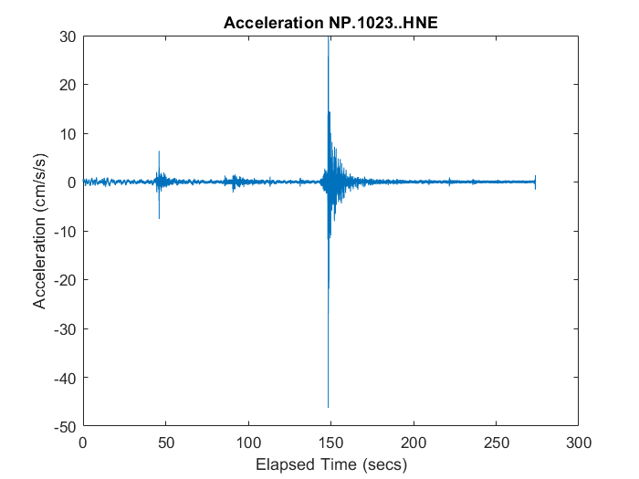

# Introduction
You can use the included Matlab functions to access information in workspace HDF5 files:
 - Basic event information (event ID, time, lat/lon/depth and magnitude) - get_events()
 - Waveform metrics (PGA, PGV, spectral acceleration, etc.) as tables - get_waveform_metrics()
 - Waveform data as a sequence of structures, one structure for each waveform - get_all_waveforms()

Below are some examples of how to use the above functions.

```
fname = 'nc73821036_workspace.h5';
events = get_events(fname);
events(1).time = datestr(events(1).time);
disp(struct2table(events(1)));
```
<table>
    <tr>
        <th>eventid</th> 
        <th>time</th>
        <th>latitude</th>
        <th>longitude</th>
        <th>depth</th>
        <th>magnitude</th>
    </tr>
    <tr>
        <td>nc73821036</td>
        <td>20-Dec-2022 10:34:24</td>
        <td>40.525</td>
        <td>-124.42</td>
        <td>17.91</td>
        <td>6.4</td>
    </tr>
</table>

```
metrics = get_waveform_metrics(fname);
disp(metrics.RotD);
```

<table>
    <tr>
        <th>event</th>
        <th>network</th>
        <th>station</th>
        <th>location</th>
        <th>channel</th>
        <th>pga</th>
        <th>pgv</th>
        <th>sa0p1</th>
        <th>sa0p2</th>
        <th>sa0p3</th>
        <th>sa0p5</th>
        <th>sa0p75</th>
        <th>sa0p15</th>
        <th>sa0p25</th>
        <th>sa0p4</th>
        <th>sa1p0</th>
        <th>sa1p5</th>
        <th>sa2p0</th>
        <th>sa3p0</th>
        <th>sa4p0</th>
        <th>sa5p0</th>
        <th>sa7p5</th>
        <th>sa10p0</th>
    </tr>
    <tr>
        <td>nc73821036</td>
        <td>NP</td>
        <td>1580</td>
        <td>10</td>
        <td>HN</td>
        <td>9.432</td>
        <td>5.7683</td>
        <td>16.114</td>
        <td>42.029</td>
        <td>20.235</td>
        <td>12.337</td>
        <td>6.9461</td>
        <td>28.474</td>
        <td>27.932</td>
        <td>12.965</td>
        <td>5.4565</td>
        <td>3.6889</td>
        <td>3.3428</td>
        <td>1.2519</td>
        <td>0.65082</td>
        <td>0.41444</td>
        <td>0.17643</td>
        <td>0.1256</td>
    </tr>
    <tr>
        <td>nc73821036</td>
        <td>NP</td>
        <td>1582</td>
        <td>10</td>
        <td>HN</td>
        <td>41.185</td>
        <td>32.652</td>
        <td>61.684</td>
        <td>85.283</td>
        <td>171.91</td>
        <td>103.85</td>
        <td>84.167</td>
        <td>60.008</td>
        <td>117.98</td>
        <td>144.77</td>
        <td>33.056</td>
        <td>11.71</td>
        <td>5.7298</td>
        <td>3.3115</td>
        <td>2.2083</td>
        <td>1.1397</td>
        <td>0.46722</td>
        <td>0.31989</td>
    </tr>
</table>

```
waveforms = get_all_waveforms(fname);
first_waveform = waveforms(1);
channel = sprintf('%s.%s.%s.%s',first_waveform.network, ...
    first_waveform.station, first_waveform.location, first_waveform.channel);
title_string = sprintf('Acceleration %s',channel);
elapsed = seconds(first_waveform.times(1:end)-first_waveform.times(1));
plot(elapsed, waveforms(1).data);
title(title_string);
xlabel('Elapsed Time (secs)');
ylabel('Acceleration (cm/s/s)');
```

